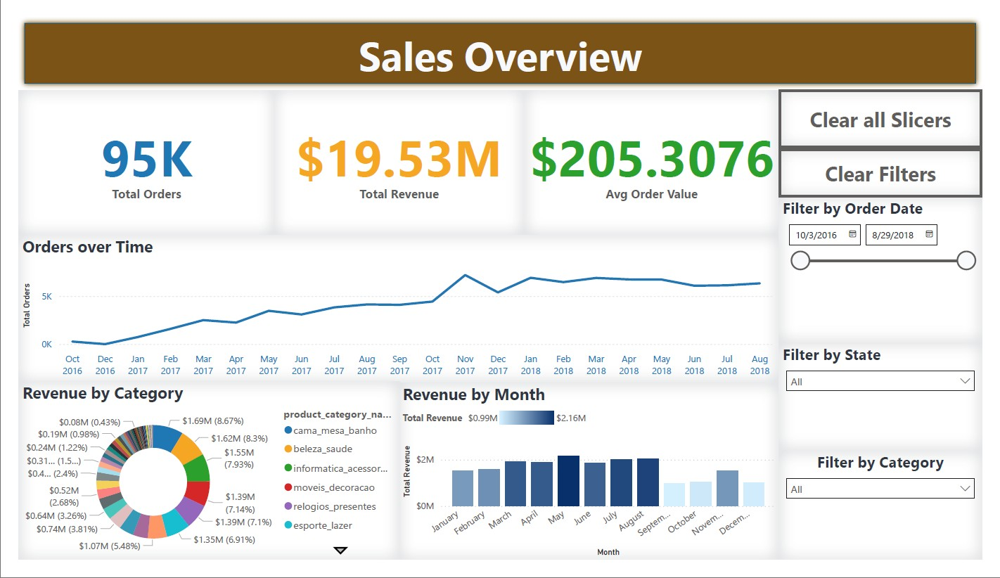
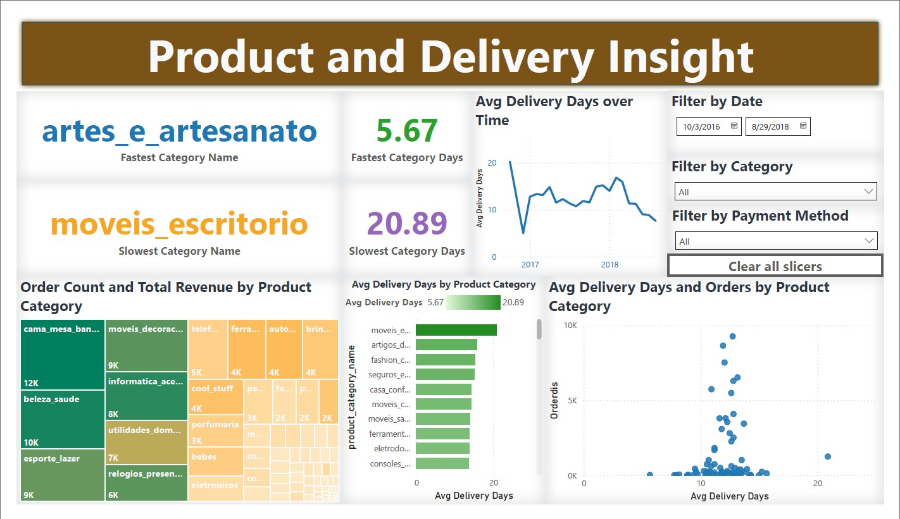

🛒 E-Commerce Data Analysis Project
------------------------------------

------------
📌 Overview
------------

This project is a **Data Analytics pipeline** built to analyze **Brazilian E-Commerce data** using **MySQL, Python (SQLAlchemy, Pandas), and Power BI**.  
It covers the full process — from **data ingestion** and **database creation** to **data cleaning, transformation, and visualization**.

The analysis provides insights into:
- Customer purchasing patterns
- Sales performance
- Product category trends
- Order delivery performance
- Payment behavior

---------------------
📂 Project Structure
---------------------

E-Commerce-Data-Analysis
│
├── customers.csv # Customers dataset
├── orders.csv # Orders dataset
├── order_items.csv # Order items dataset
├── products.csv # Products dataset
├── payments.csv # Payments dataset
│
├── Table Creation.sql # SQL script to create database tables
├── Table Import.sql # SQL script to import CSV data into MySQL
├── E_commerce_project_sqlalchemy.ipynb # Python ETL & analysis with Pandas + SQLAlchemy
├── E_commerce_project.pbix # Power BI dashboard file
│
└── README.md # Project documentation
 

-------------------
🗄️ Database Design
-------------------

Relational schema was created in MySQL.

Tables:
1. customers
2. orders (linked to customers)
3. order_items (linked to orders & products)
4. products
5. payments

ER Diagram Overview:

customers ───< orders ───< order_items >─── products
│
└───< payments

----------------
🔄 Data Loading
----------------

The dataset CSV files are loaded into MySQL using:
- `LOAD DATA INFILE` for bulk import
- Script: [`Table Import.sql`](Table%20Import.sql)

---------------------------------------
🐍 Python Integration (ETL & Analysis)
---------------------------------------

- Tool: SQLAlchemy + Pandas
- Purpose: Automate queries, data cleaning, and preprocessing
- Script: [`E_commerce_project_sqlalchemy.ipynb`](E_commerce_project_sqlalchemy.ipynb)
- Key tasks:
  - Connecting Python to MySQL
  - Querying data for insights
  - Exporting cleaned data for Power BI

----------------------
📊 Power BI Dashboard
----------------------

The interactive dashboard (`E_commerce_project.pbix`) visualizes:
- KPIs: Total Sales, Orders, Customers, Average Order Value
- Sales by Product Category
- Monthly Sales Trends
- Order Status Distribution
- Payment Method Usage
- Delivery Performance

---------------------
📸 Dashboard Preview
---------------------

Page 1

Page 2

Page 3

---------------------------
🚀 How to Run This Project
---------------------------

1️⃣ Setup MySQL Database

-- Create tables
SOURCE Table Creation.sql;
-- Import CSV data
SOURCE Table Import.sql;

2️⃣ Run Python Analysis

pip install pandas sqlalchemy mysql-connector-python
jupyter notebook E_commerce_project_sqlalchemy.ipynb

3️⃣ Open Power BI Dashboard

Open E_commerce_project.pbix in Power BI Desktop
Refresh data connection if needed

------------------------
📈 Insights & Learnings
------------------------

Page 1 – Sales Overview

Shows overall order volume, total revenue, and average order value trends.
Highlights sales growth over time with noticeable seasonal peaks.
Reveals top-earning product categories and monthly revenue patterns.

Page 2 – Customers Insight

Displays customer distribution across states and cities.
Highlights which states generate the most orders.
Shows preferred payment methods used by customers.

Page 3 – Product & Delivery Insight

Compares fastest and slowest delivery categories.
Shows order count and revenue per product category.
Analyzes how delivery times vary by product category.

------------------------
🛠️ Tools & Technologies
------------------------

Database: MySQL
Data Processing: Python (Pandas, SQLAlchemy)
Visualization: Power BI
Data Source: CSV files

-----------
📜 License
-----------

This project is licensed under the MIT License.
